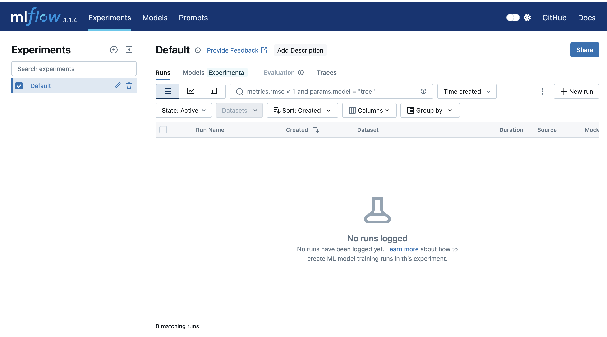
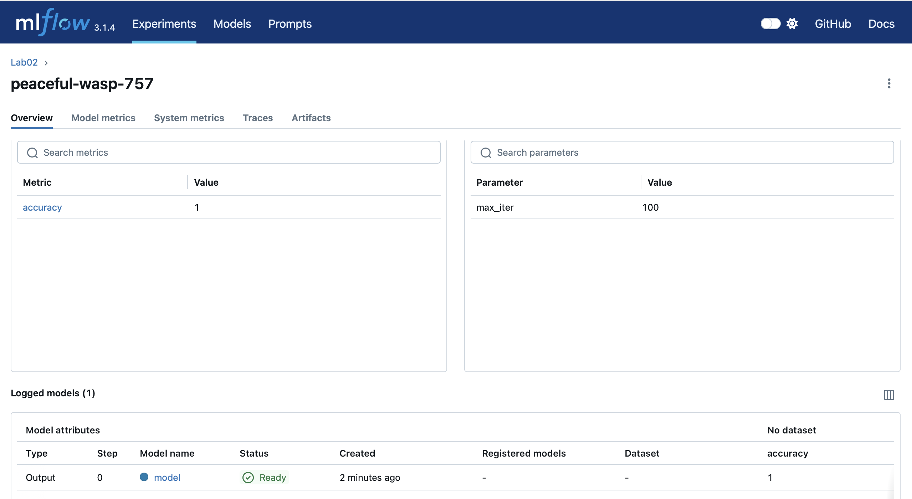
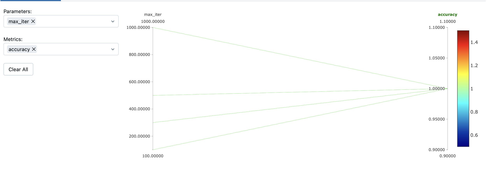
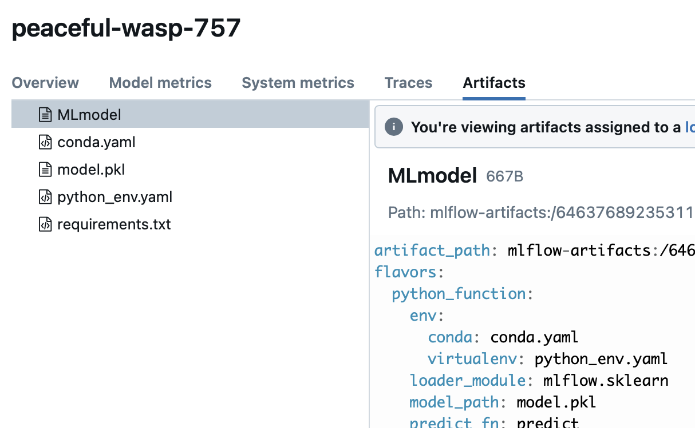
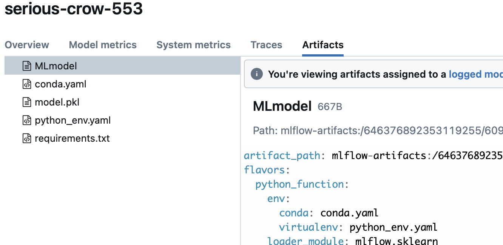
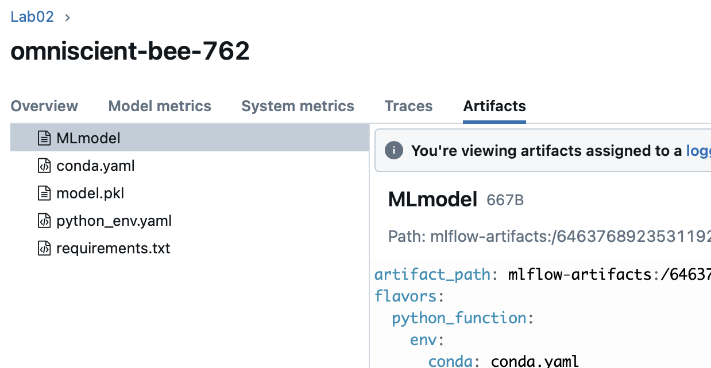
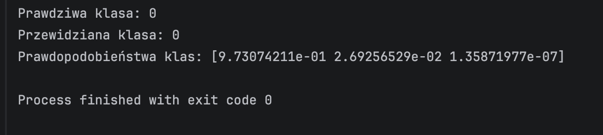

# Lab02

**Zadanie 1**
Udało się uruchomić MLflow, interfejs działa poprawnie.

**Zadanie 2**
Eksperyment wykonał się poprawnie. W MLflow widać zalogowany parametr, metrykę oraz model.

**Zadanie 3**
Eksperymenty porównałam zmieniająć hiperparametr max_itier na wartości: 1000,500,300 oraz 100. Dla każdego z tych wariantów wynik accuracy wynosił 1. Oznacza to, że w badanym przypadku zmiana liczby iteracji nie wpłynęła na skuteczność modelu. Każda z testowanych konfiguracji osiągnęła taki sam, najlepszy wynik.

**Zadanie 4**
Po każdym uruchomieniu skryptu w sekcji Artifacts pojawiał się zapisany model. Widoczne były pliki takie jak MLmodel oraz conda.yaml lub requirements.txt, które zawierają informacje o sposobie zapisu modelu i wymaganych bibliotekach.
Każdy run tworzył osobną wersję modelu, dzięki czemu możliwe jest przechodzenie między różnymi wersjami i odwoływanie się do nich za pomocą Id runa.

**Zadanie 5**
Model poprawnie przewidział klasę 0 oraz zwrócił prawdopodobieństwa klas.

